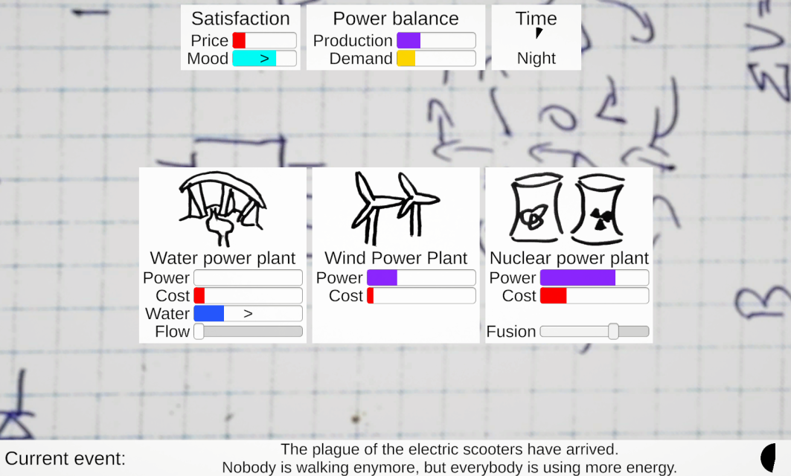

# Gridlock! - Ludum Dare 51

A game about balancing the electrical grid of a country.  
Can you satisfy the growing electricity demands without turning to astronomical prices?

My entry to the 51:th Ludum Dare game jam (theme: *Delay the inevitable*), following the compo rules (alone, from scratch, 48 hours).

[Play the game in Your browser](https://aggrathon.github.io/LudumDare51/) or [check out the Ludum Dare entry](https://ldjam.com/events/ludum-dare/51/gridlock)!

## Software Used

Unity (game engine), Visual Studio Code (code), Audacity (sound), Bosca Ceoil (sound), a whiteboard (art), git (version control), and Github (hosting).
